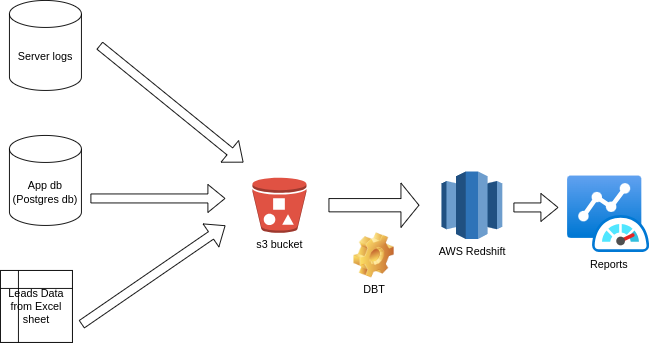
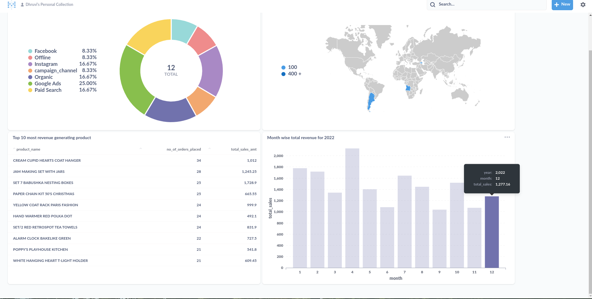
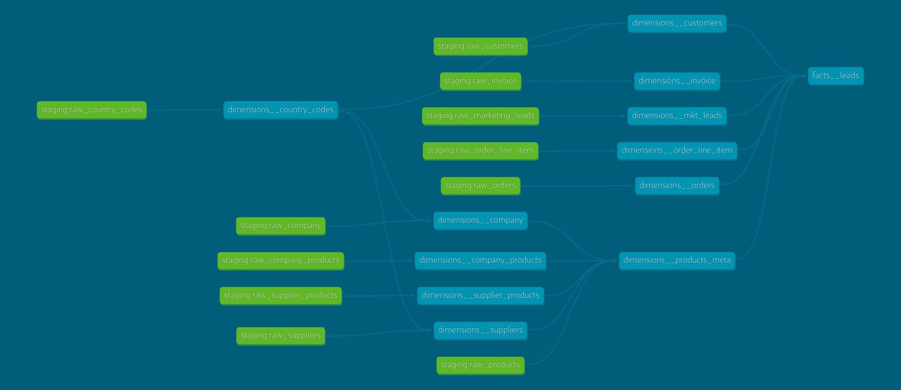

# Data Engineering Pipeline

## Brief
This pipeline is build using following stack:
- Apache Airflow (for orchestrating)
- DBT (for modelling and documenting)
- AWS Redshift (as data warehouse)
- Metabase for dashboarding
- Postgres as application database

## Project Flow
- The application db is initialized with schema and initial data (refer init-scrips)
- There are 3 airflow dags created:
  - `generate_data_for_testing`: wich contains 2 tasks;
    - `init_dw_schema`: it drops the existing `raw__` tables from the staging schema and creates them again 
    - `generate new orders`: It take the (static)data from application db i.e. customers, suppliers, company, products, country_codes, suppliers_products, company_products -> to generate the orders data i.e. will populate the orders, invoice and order_line_item tables. Along with orders data; this tasks also generate the dummy leads data and dummy web server logs
  - `data_ingest_pipeline`: It takes and ingests the fresh generated data from application db, leads and server logs to the redshift staging
  - `dbt_data_dag`: this dag runs the data modelling queries with dbt to populate the tables in reporting schema

## Architecture diagram
The high level architecture of the pipeline is as below:

## Dashboards:
Below dashboard answer 4 questions:
- The Promotion attribution; i.e. how effective is the marketing campaign in bringing paying customers
- Top 10 most revenue generating products
- Top locations from where most users are logged in to the application
- Month wise total sales of last year

## How the project can be scaled
The Orchestration is done using Airflow - which can be easily scaled when there is an increase inneed to parallel execution.
The processing/ modelling is done using DBT - which can be plugged to SPARK on EMR/ Databricks cluster to process bulk of data

## Data Modelling
The 3 major Facts tables generated from the pipeline which powers the above dashboard are as below:
- facts__leads

- fact__sales

.png)

- fact__user_journey
- 
.png)

